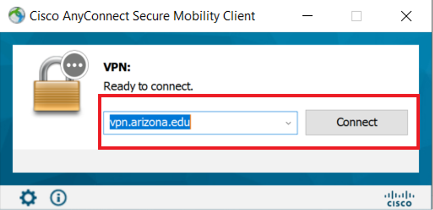
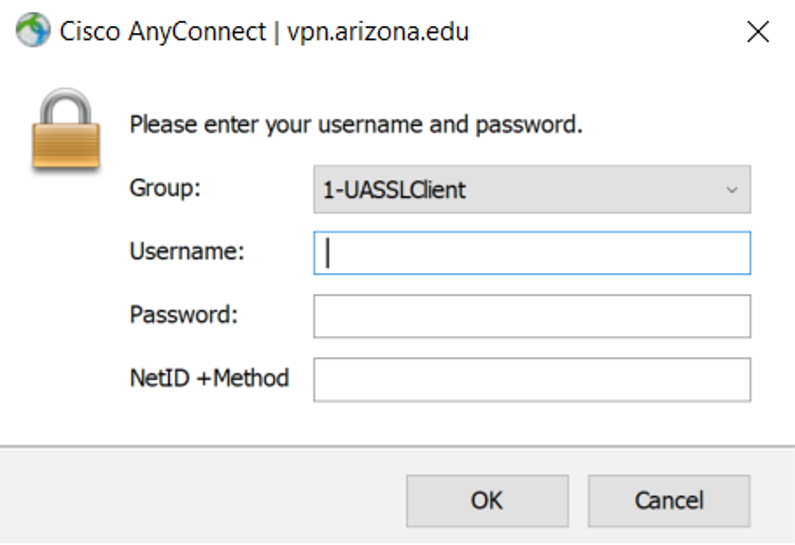
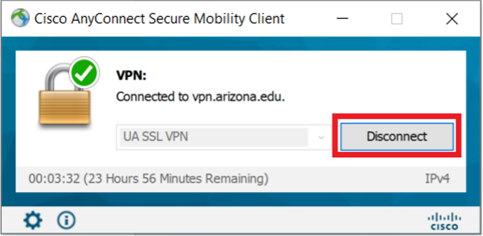

# User-Manuals
---
title: "Posit Connect Health Startup Tutorial"
format:
  html:
    theme: cosmo
    code-copy: true
    toc: true
---

{width="349"}

```{r setup, include = F}
if (!require(devtools)) install.packages('devtools')
devtools::install_github("hadley/emo")
```

# Background

Posit Connect (formerly known as RStudio Connect) is a tool that allows for organizational sharing of items published from RStudio such as [Shiny apps](https://shiny.rstudio.com/), interactive graphs and reporting documents (such as this one created with [Quarto](https://quarto.org/)). This document is intended to walk RStudio users through the process of establishing an Posit Connect account, connecting to Posit Connect from RStudio, and publishing a document to Posit Connect.

To access Posit Connect Health however, you will first need to have access to the Soteria enclave.

# Request Access to Soteria

1.  Establish a primary PI or sponsoring faculty member and have them indicate that you are a team member on Soteria.
2.  Open <https://soteria.arizona.edu/> and click **Request Access**.

{width="532"}

3.  Fill out the form with your user and project information. Once submitted you will receive an automated email indicating completion of the request.
4.  Once approved, you will receive a secondary automated email, UA Soteria Access Request Approved indicating required trainings. Log into Edge Learning (<https://edgelearning.arizona.edu/>) to sign up and complete all of the required trainings.

## Download and Set up Cisco VPN

1.  Download the VPN software by following the link (<https://vpn.arizona.edu/+CSCOE+/logon.html#form_title_text>) . You will be prompted to log in. Use the default connections. Enter your NetID, Password and NetID +Method (ex: "push").

{width="334"}

2.  Follow the prompts to download and install Cisco AnyConnect VPN.

{width="168"}

{width="4143"}

::: panel-tabset
## Mac


## Windows

{width="3302"}
:::

2.  Open Cisco AnyConnect VPN on your desktop.
3.  The first connection must be to: vpn.arizona.edu. Type into the pop-up and click **connect**.

{width="334"}

5.  Sign in as before, using the default group. Enter your NetID, Password and NetID +Method (ex: "push").

{width="334"}

6.  Click **Disconnect**

{width="334"}

You are now ready to connect to your Soteria VPN.

## Connect to Soteria VPN

1.  If it does not auto-populate, connect to the Soteria VPN using: vpn.arizona.edu/soteria. Again, enter your NetID, Password and NetID +Method (ex: "push") to sign in.

{width="334"}

2.  Accept the pop-up notification. The Cisco Icon in the system tray (bottom right) of your desktop, will now display a lock, indicating a successful connection.
