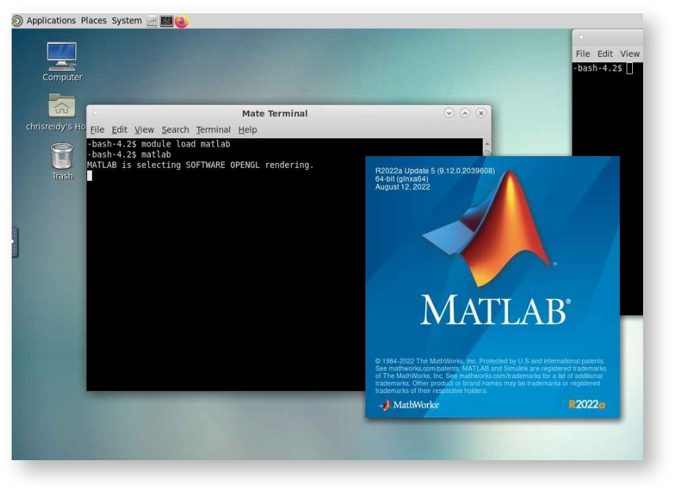

{width="340"}

---

# **The Secure Research Enclave and HPC Cluster**

This user manual will guide you through the high-performance computing (HPC) features and functionalities of Soteria. The HPC cluster is equipped with multiple compute nodes (CPU) and two GPU nodes available for specific needs.

To access Soteria, you can utilize the OnDemand graphical user interface, which provides a user-friendly interface for seamless interaction with the enclave.

We hope this manual assists you in making the most of Soteria's capabilities while ensuring the confidentiality and security of your research data.

---

## Prerequisites: Accessing Soteria and Cluster Resources

### Accessing the Soteria Enclave

!!! Info "*Please refer to the [Obtaining Soteria Access via VPN](access_vpn.md) for Soteria access details.*"

**Trainings**: Once your Soteria request form has been reviewed and approved, you will receive an email with the subject "*UA Soteria Access Request Approved*". This email will contain the next steps to take, including detailed instructions to get Soteria access and establish a VPN connection.

!!! Warning "Required Trainings"

    The trainings that Soteria requires completion of are:

    - HIPAA Essentials
    - UA Information Security Awareness Training
    - Insiders Threat Training

        These can be accessed at [uaccess.arizona.edu](https://uaccess.arizona.edu/) or [edgelearning.arizona.edu](https://edgelearning.arizona.edu/).

**Access to Soteria**: After completing the required trainings, you will be notified via email when you have been granted access to the Soteria VPN. The Soteria VPN is crucial for maintaining HIPAA compliance and distinguishes Soteria usage from standard HPC clusters. Please note that Soteria access can only be established when connected to the VPN. 

- [Obtaining the Cisco VPN](access_vpn.md/#downloading-cisco-vpn) 
- [Connecting to the Soteria enclave](access_vpn.md/#connecting-to-the-soteria-enclave)

!!! Info "Additional Instructions" 
    
    Ensure that the computer you will use to access Soteria services meets the following requirements:

    - Keep your Operating System and applications updated.
    - Use strong passwords (easy to remember, multiple character, letter, number combinations).
    - Do not use a shared computer with other users.
    - Maintain up-to-date antivirus software.

### Cluster Resources

Please refer to the regular [HPC documentation](https://uarizona.atlassian.net/wiki/spaces/UAHPC/overview) to learn how to use the HPC system. During the early testing phase, the time and space allocations will be similar to those of the HPC clusters, with a time allocation of 150,000 hours.

The Soteria cluster consists of the following resources:

- **Compute**:
    - 4 Standard CPU nodes (`r1u26n1`, `r1u27n1`, `r1u28n1`, `r1u29n1`)
        - Each CPU node has 94 cores and 512GB RAM memory available.
    - 2 GPU Nodes (`r1u30n1`, `r1u32n1`)
        - Each GPU node has access to 94 cores and 512GB RAM memory available.
        - Access to 4 V100 GPUs.
- **Storage**: 
    - Your Soteria account will come with space available in the `/home` and `/groups` directories, where you can store your research data. Currently, these directories do not have a quota limit.

---

## Accessing the HPC Soteria Enclave and GUI Applications

!!! Info "*To access the HPC Soteria enclave, please ensure that you are connected to the Soteria VPN as explained in the previous section.*"

To access GUI applications, follow these steps after connecting to the Soteria VPN:

1. Open your preferred web browser.
2. Visit the following URL: [**https://ondemand-hipaa.hpc.arizona.edu**](https://ondemand-hipaa.hpc.arizona.edu/). Log in using your UA credentials.
3. The available GUI applications on Soteria are **:simple-rstudio: RStudio**, **:material-chart-bell-curve: Matlab**, **:simple-jupyter: Jupyter**, **:material-apps-box: Stata** and an **:octicons-device-desktop-16: Interactive Desktop**.

??? Warning "First time logging in? Home directory not found?"

    If this is your first logging onto the OnDemand Soteria service, it is likely that you're going to be greeted with the following message:

    <figure markdown="span">
        {width="650"}
    </figure>
    If that is the case, follow the onscreen instructions:

    1. Open the shell (which will automatically create your home folder).
    2. Reload the page.

    Once that is done, you should be greeted with the OnDemand home page.

    <figure markdown="span">
        {width="650"}
    </figure>

### Connecting to the Applications

!!! Tip "The following section uses RStudio as an example, however, these same instructions are applicable to **:material-chart-bell-curve: Matlab**, **:simple-jupyter: Jupyter**, **:material-apps-box: Stata** and the **:octicons-device-desktop-16: Interactive Desktop**."

1. Once you access the OnDemand interface, navigate to the "Interactive Apps" dropdown menu.
2. Select the desired application from the options, in this case "RStudio server" was chosen.
    <figure markdown="span">
        {width="650"}
    </figure>
3. Apply the necessary resources and enter your laboratory/research group in the "PI Group" field.
    <figure markdown="span">
        {width="700"}
    </figure>
4. Connect to the requested node by clicking "Connect to RStudio Server".
    <figure markdown="span">
        {width="700"}

!!! Info "Choosing the **:octicons-device-desktop-16: Interactive Desktop** gives you access to more."

    The :octicons-device-desktop-16: Interactive Desktop gives you access to the ability to load **modules**. Modules are pre-installed software that are not loaded upon starting the Application/terminal but users can load at any point during the node uptime.

    Once logged into the :octicons-device-desktop-16: Interactive Desktop, users can open the Terminal and execute `module avail` to see what software are available. To load the software, users can then do `module load <software>`; The loaded software will then be available until the :octicons-device-desktop-16: Interactive Desktop is terminated.

    For a list of `module` commands, please refer to the [official UA HPC documentation page](https://uarizona.atlassian.net/wiki/spaces/UAHPC/pages/75990663/Accessing+Software).
    <figure markdown="span">
        {width="650"}
        <figcaption> Example of `module load <software>` where the user loads and launches Matlab through `module load matlab` and `matlab` within the :octicons-device-desktop-16: Interactive Desktop session. </figcaption>
    </figure>
    

### Command Line Access

To access Soteria through your computer's command line, you can use SSH (Secure Shell) with the following instructions:

1.  Open your preferred terminal application on your local machine.
2.  Use the SSH command to connect to Soteria. The hostname for Soteria command line access is: `shell.cougar.hpc.arizona.edu`. Enter the following command, replacing `<netid>` with your actual NetID: 
    ```
    ssh <netid>@shell.cougar.hpc.arizona.edu
    ```
3.  You will be prompted to enter your password. Please provide your password associated with your NetID. Make sure you have authorized access to use Soteria. All user activity may be monitored and reported.
4.  After successfully logging in, you will see a message similar to the following:
    ```
    Authorized uses only. All activity may be monitored and reported.
    Last login: Tue Apr 30 13:14:23 2024 from shell.cougar.hpc.arizona.edu
    Authorized uses only. All activity may be monitored and reported.
    [cosi@taub ~]$ 
    ```
    The `taub` is a login node, and it provides the same functionality and follows the same policies as other HPC clusters.

5.  Please note that modules are available on Soteria's compute nodes but not on the login node. You can use the **`interactive`** command to request a session on a compute node, and jobs can be submitted using the standard **`sbatch`** command.

    For more detailed information on running jobs with SLURM and utilizing Soteria's capabilities, please refer to the [UA HPC documentation on "Running Jobs with Slurm"](https://uarizona.atlassian.net/wiki/spaces/UAHPC/pages/75989875/Running+Jobs+with+Slurm).

If you do not have access to a command line, the OnDemand service allows you to start a cluster with Shell Access. On the menu at the top of the OnDemand dashboard select Clusters > Shell Access. A new tab should open giving you CLI capabilities. 

<figure markdown="span">
    {width="700"}
</figure>

---

## Transferring and Accessing Data via Globus

Globus is a recommended tool for efficiently transferring data to and from the Soteria environment. It provides a reliable and secure data transfer mechanism. To learn more about using Globus, please refer to the following link: [**Globus Documentation**](https://uarizona.atlassian.net/wiki/spaces/UAHPC/pages/75989646/Globus).

!!! Note "Soteria Endpoint for Globus: '`UA HPC HIPAA Filesystems`'"

**File Paths:** When working with Soteria, you can access your files using the following file paths:

1.  Filexfer Nodes:
    -   **`/hipaa/groups/<pi_netid>`**: This path allows access to the shared group directories associated with your PI's NetID.
    -   **`/hipaa/home/<uxx>/<your_netid>`**: This path provides access to your personal home directory under your NetID.

2.  When connected to a Soteria login or compute node:
    -   **`/groups/<pi_netid>`**: This path corresponds to the shared group directories associated with your PI's NetID.
    -   **`/home/<uxx>/<your_netid>`**: This path corresponds to your personal home directory under your NetID.

By utilizing these file paths, you can efficiently access and manage your data within the Soteria environment.