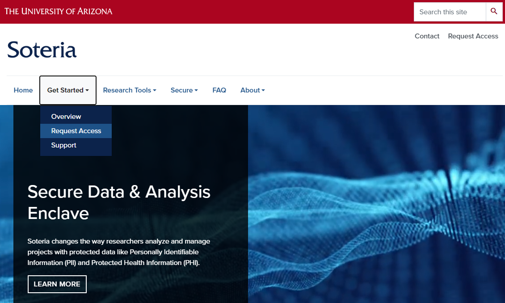
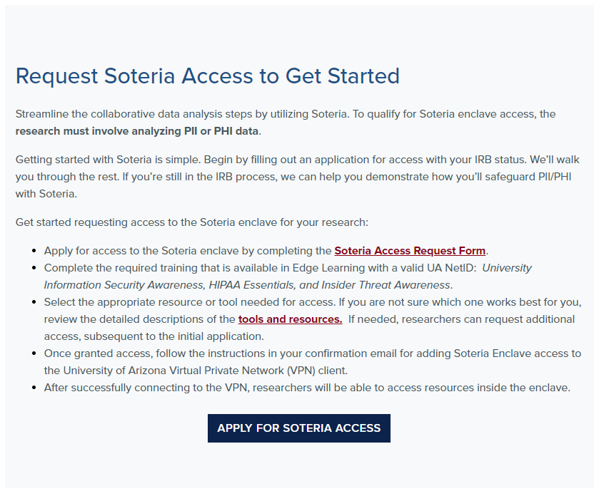
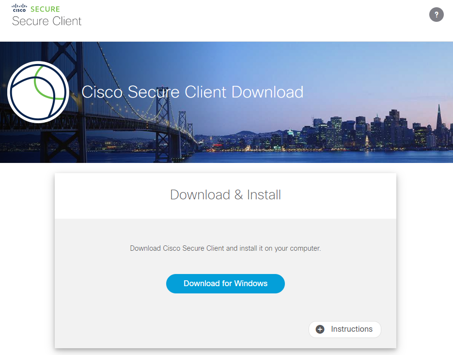
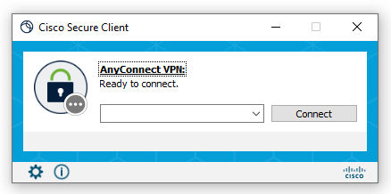
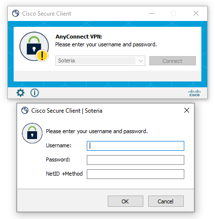
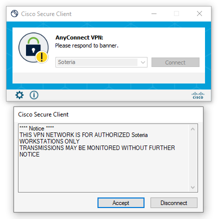
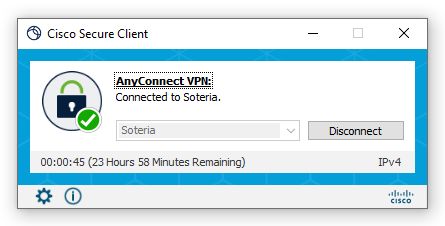

{width="340"}

---

# **Accessing Soteria via VPN**

## Request Access to Soteria

1.  Establish a primary PI or sponsoring faculty member and have them indicate that you are a team member on Soteria.
2.  Navigate to [soteria.arizona.edu](https://soteria.arizona.edu/), and from the *Get Started* dropdown menu click **Request Access**. Alternatively, you can click **Request Access** on the top right of the screen.

    <figure markdown="span">
        [{ width="800"}](https://soteria.arizona.edu/)
    </figure>
3.  This will open the Request Access page. Click **Apply for Soteria Access** and Fill out the form with your user and project information. Once submitted you will receive an automated email indicating completion of the request.

    <figure markdown="span">
    [{ width="800"}](https://soteria.arizona.edu/get-started/request-access)
    </figure>
4.  Once approved, you will receive a secondary automated email (title: *UA Soteria Access Request Approved*) indicating that you've been approved access and the required trainings needed to use Soteria. Log into [Edge Learning](https://edgelearning.arizona.edu/) to sign up and complete all of the required trainings.

    !!! Warning "Required Trainings"

        The trainings that Soteria requires completion of are:

        - HIPAA Essentials
        - UA Information Security Awareness Training
        - Insiders Threat Training

## Downloading Cisco VPN

!!! Warning "In order to access the Cisco VPN download page and other University of Arizona services including Soteria, one must have a functional [UA NetID](https://netid-portal.iam.arizona.edu/) with <u>Duo authentification enabled</u>."

??? Tip "First time using a VPN?"

    If this is your first time using a VPN, we suggest reading [this general guide on connecting and using the VPN service](https://cbc.arizona.edu/vpn-instructions) from the UA Chemistry & Biochemistry Department or watching this short video from the Nursing department:

    <figure>
        <iframe src="https://player.vimeo.com/video/415856895?h=ca3796f8fe" width="640" height="360" frameborder="0" allow="autoplay; fullscreen; picture-in-picture" allowfullscreen></iframe>
        
<a href="https://vimeo.com/415856895">Getting Started with UArizona VPN - Windows</a> from <a href="https://vimeo.com/wildcatnursing">UA College of Nursing</a> on <a href="https://vimeo.com">Vimeo</a>.

    </figure>

If you have not done so yet, go to the download page of the the Cisco VPN software at [vpn.arizona.edu](https://vpn.arizona.edu/). Log in using your UA NetID information and download the VPN according to your Operating System. Download and install Cisco VPN. 

<figure markdown="span">
    [{ width="800"}](https://vpn.arizona.edu/)
</figure>

## Connecting to the Soteria Enclave

When opening Cisco VPN you will be greeted with the following log in window. 

<figure markdown="span">
    
</figure>

The typable field will allow you to type any VPN host associated to the University of Arizona. By default, you should be able to select *UA SSL VPN*. However, in order to connect to the Soteria VPN, you will need to insert the following URL: **vpn.arizona.edu/soteria**. In the future, the field should autopopulate to **Soteria**. Upon clicking **Connect** a second window will open, where you can insert your UA NetID, Password and NetID +Method (e.g.,: "push") to sign in. 

<figure markdown="span">
    
</figure>

??? Tip "First time connecting to Soteria and having trouble? You may have to connect to the UA VPN." 
    
    In the typable field, type **vpn.arizona.edu** and Connect. Follow the connection instructions and establish connection first. Then disconnect from the UA VPN, and then connect to the Soteria VPN. Cisco *might* need to establish the connection first.

When you see the following popup, **accept** the message and you will be connected to the Soteria enclave. 

<figure markdown="span">
    
</figure>

The Cisco VPN icon will show a lock in front, meaning that the connection is working, secured and metered. You can now proceed to using he various services within the safe Soteria enclave!

<figure markdown="span">
    
</figure>
