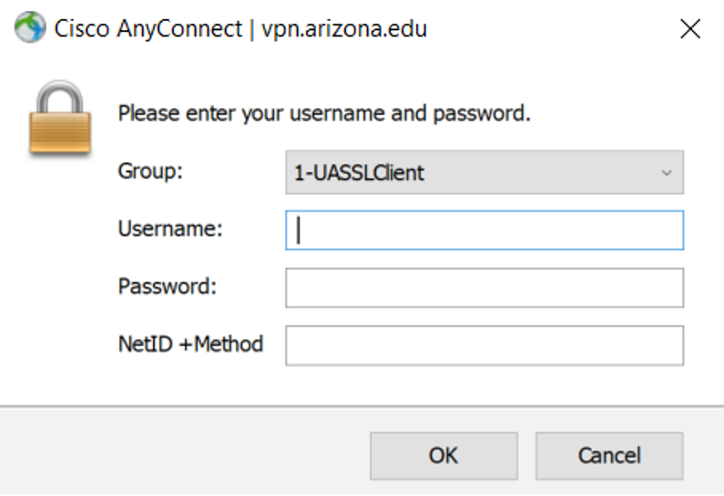
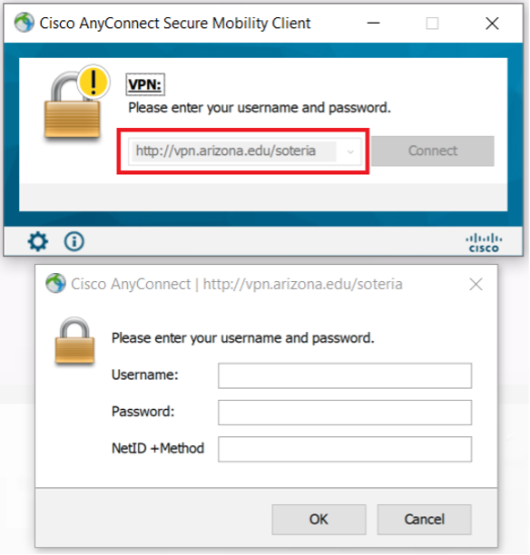

{width="340"}

---

# **Accessing Soteria via VPN**

## Request Access to Soteria

1.  Establish a primary PI or sponsoring faculty member and have them indicate that you are a team member on Soteria.
2.  Navigate to https://soteria.arizona.edu/, and from the *Get Started* dropdown menu click **Request Access**. Alternatively, you can click **Request Access** on the top right of the screen.
    <figure markdown="span">
        [{ width="800"}](https://soteria.arizona.edu/)
    </figure>
3.  This will open the Request Access page. Click **Apply for Soteria Access** and Fill out the form with your user and project information. Once submitted you will receive an automated email indicating completion of the request.
    <figure markdown="span">
    [{ width="800"}](https://soteria.arizona.edu/get-started/request-access)
    </figure>
4.  Once approved, you will receive a secondary automated email (*UA Soteria Access Request Approved*) indicating that you've been approved access and the required trainings needed to use Soteria. Log into [Edge Learning](https://edgelearning.arizona.edu/) to sign up and complete all of the required trainings.

    !!! Warning "Required Trainings"

        The trainings that Soteria requires completion of are:

        - HIPAA Essentials
        - UA Information Security Awareness Training
        - Insiders Threat Training

## Download and Set up Cisco VPN

1.  Download the VPN software by following the link (<https://vpn.arizona.edu/+CSCOE+/logon.html#form_title_text>) . You will be prompted to log in. Use the default connections. Enter your NetID, Password and NetID +Method (ex: "push").

{width="330" fig-align="center"}

2.  Follow the prompts to download and install Cisco AnyConnect VPN.

{width="168" fig-align="center"}

{width="550" fig-align="center"}

{width="550" fig-align="center"}

3.  Open Cisco AnyConnect VPN on your desktop.
4.  The first connection must be to: vpn.arizona.edu. Type into the pop-up and click **connect**.

{width="350" fig-align="center"}

5.  Sign in as before, using the default group. Enter your NetID, Password and NetID +Method (ex: "push").

{width="350" fig-align="center"}

6.  Click **Disconnect**

{width="350" fig-align="center"}

You are now ready to connect to your Soteria VPN.

## Connect to Soteria VPN

1.  If it does not auto-populate, connect to the Soteria VPN using: vpn.arizona.edu/soteria. Again, enter your NetID, Password and NetID +Method (ex: "push") to sign in.

{width="350" fig-align="center"}

2.  Accept the pop-up notification. The Cisco Icon in the system tray (bottom right) of your desktop, will now display a lock, indicating a successful connection.
