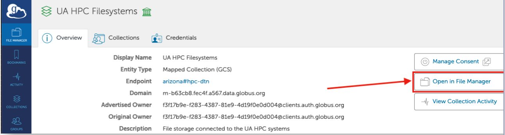
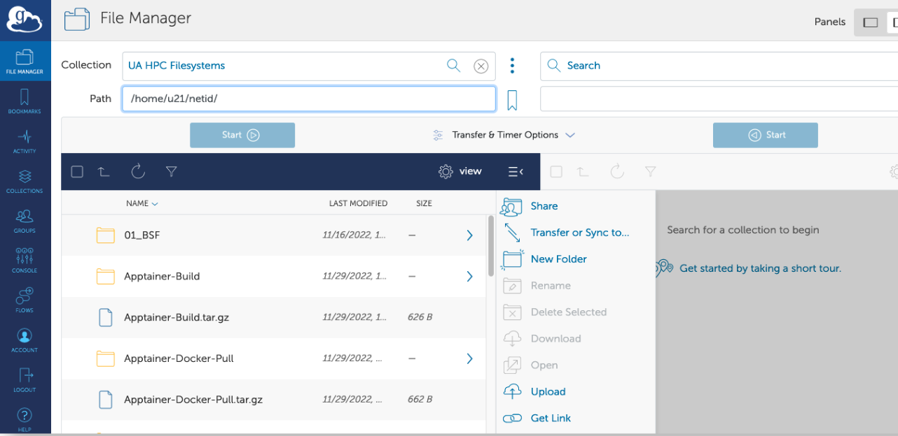
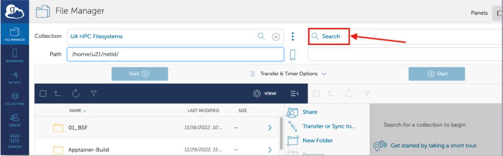

{width="340"}

---

# **Transferring Data Using Globus**

Welcome to the Globus Data Transfer with GridFTP, specifically tailored for the Soteria environment. Within Soteria's UA HPC HIPAA Filesystems, data movement becomes a breeze with the powerful capabilities of Globus and GridFTP.

In this manual, we'll explore how GridFTP, an extension of the standard File Transfer Protocol (FTP), elevates data transfer to new heights. Its focus on high-speed, reliable, and secure transmission perfectly complements the demands of Soteria's environment. With Globus as your platform of choice, you'll find endpoints to be the key to effortless data transfers.

Whether you're involved in research, data analysis, or IT management, understanding the benefits of GridFTP through Globus will empower you to handle large-scale data transfers with ease. Say goodbye to complex transfer processes and embrace a seamless approach to sharing data across all clusters in the shared storage.

## Accessing Globus and Globus Connect Personal

!!! Warning "Visit the [UA official documentation](https://uarizona.atlassian.net/wiki/spaces/UAHPC/pages/75989646/Globus) for a detailed step by step guide to access Globus." This will take you through the standard university WebAuth login process. Once you successfully log in, you will be placed in a File Manager window. The various steps for setting up endpoints, initiating transfers, and viewing a transfer's progress can be found in the sections below.

To transfer files to/from your personal computer with Globus, you'll need to have a local endpoint set up. In case of Soteria, the endpoint is **`UA HPC HIPAA Filesystems`**.

This can be achieved using **Globus Connect Personal**. Official documentation on how to install the relevant software and configure a local endpoint can be found in [Globus' offical how-to documentation](https://docs.globus.org/how-to/). An overview is shown [here](https://uarizona.atlassian.net/wiki/spaces/UAHPC/pages/75989646/Globus#:~:text=the%20sections%20below.-,Globus%20Connect%20Personal,-To%20transfer%20files) for Mac, Linux, and Windows.

### Accessing HPC Storage Endpoint

To access the HPC Storage Endpoint in the Soteria environment, follow these steps:

- **Step 1:** Locate the Collections Tab After logging into Globus, navigate to the "Collections" tab.
- **Step 2:** Search for UA HPC Filesystems In the search field, type "UA HPC Filesystems" and select the relevant result.
<figure markdown="span">
  {width="650"}
</figure>
- **Step 3:** Open the HPC Storage Endpoint Click "Open in File Manager" to access your HPC files. The default location will be your "/home" on HPC.
<figure markdown="span">
  {width="650"}
</figure>
- **Step 4:** Navigating HPC Files Navigate through directories by double-clicking on folders or by entering a full path in the Path search bar and hitting "Enter." This method allows access to any `/xdisk` or `/groups` directories you have permissions for.
<figure markdown="span">
  {width="650"}
</figure>

## Making Data Transfers

To initiate data transfers between endpoints using the File Manager window, follow these steps:

- **Step 1:** Access the File Manager Tab Go to the "File Manager" tab in the Globus web application. Ensure you have dual-panel mode enabled (click the upper right-hand corner with the red arrow) to open two endpoints simultaneously.
<figure markdown="span">
  {width="650"}
</figure>
- **Step 2:** Open the First Endpoint Click the Search bar on the left-hand side and search for your first endpoint (e.g., UA HPC Filesystems). Click the result to open it.
<figure markdown="span">
  {width="650"}
</figure>
- **Step 3:** Open the Second Endpoint To open a second connection, click the Search bar on the right-hand side. Search for your next endpoint (e.g., a personal endpoint) or access recently used endpoints and collections under the "Recent" and "Your Collections" tabs. Click the result to open the second endpoint.
<figure markdown="span">
  {width="650"}
</figure>
<figure markdown="span">
  {width="650"}
</figure>
- **Step 4:** Start the Transfer Select the item(s) you want to transfer from the first endpoint, then click the "Start" button to initiate the transfer to the second endpoint.
<figure markdown="span">
  {width="650"}
</figure>

## Monitoring Your Transfers

After initiating a transfer, a green box will appear confirming the request. To monitor your transfers:

- **Step 1:** Access the Activity Panel On the left-hand side of the page, access the "Activity" panel. This will display active and past transfers along with their status.
<figure markdown="span">
  {width="650"}
</figure>
- **Step 2:** View Transfer Details To view additional details about your transfers, click the "\>" symbol next to the target task on the right-hand side. This will provide more information about the ongoing or completed transfer.
<<figure markdown="span">
  {width="650"}
</figure>
- **Step 3:** Cancel a Transfer If needed, you can cancel a transfer by clicking the "×" symbol on the right.
- **Step 4:** Receive Transfer Status Email Once your transfer is completed, you will receive an email with its status.

Congratulations! You have now learned how to access the HPC Storage Endpoint and perform data transfers using Globus. With this powerful tool, managing data within the Soteria environment becomes efficient and straightforward. Happy data transferring!
