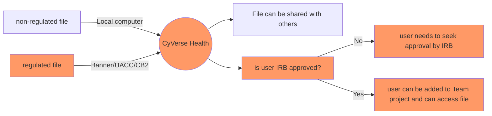
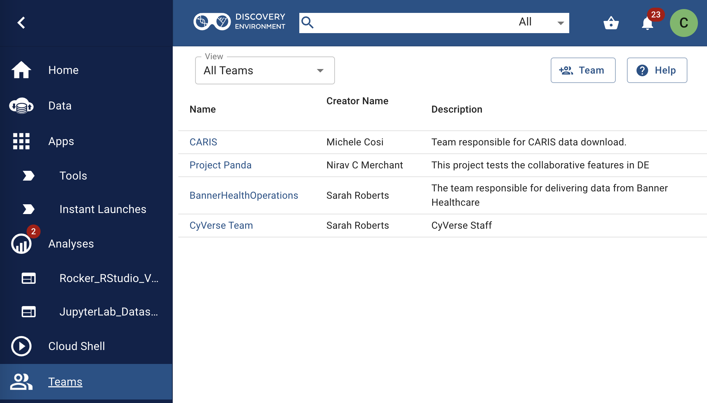

{width="340"}

<br>


<br>

# **CyVerse Health User Manual Overview**

---

## CyVerse Health: Spotlight on Functionality

Within the secure perimeters of Soteria lies CyVerse Health, a specialized web workbench designed for data science teams navigating the complex landscapes of PII and PHI. This component amplifies Soteria’s functionalities, providing a space where collaboration, customization, and control converge.

Key features of CyVerse Health include:

**Collaborative Workbench:** CyVerse Health offers a dynamic space where research teams can manage data and share customized workflows securely. This feature is instrumental in fostering collaboration and ensuring consistency across projects.

**Reproducible Research:** With its emphasis on containerization technology, CyVerse Health enables users to create reproducible workflows, a cornerstone in promoting transparency and verifiability in scientific discoveries.

**Secure Data Access:** It maintains a controlled environment where access to specific data sets is regulated, ensuring that only authorized individuals can view or manipulate sensitive information.

CyVerse Health therefore supports researchers by providing a secure, collaborative platform equipped with tools designed for in-depth data exploration and analysis, all within the secure ecosystem provided by Soteria.

##  Synergy: How CyVerse Health Complements Soteria

CyVerse Health is an integral part of the Soteria platform, designed to extend the capabilities provided by Soteria into more specialized areas of data management and analysis. It leverages Soteria’s foundational security infrastructure, providing a space where researchers can perform more nuanced tasks with an assurance of data protection.

This integration ensures that while researchers benefit from advanced tools and collaborative features specific to CyVerse Health, they remain within the overarching secure environment established by Soteria. This interconnectedness makes the combined platform a robust, comprehensive solution for conducting sensitive health-related research projects securely.

---

## Getting Started with CyVerse Health

!!! Warning "Getting Soteria Access"
    Before diving into the specific features and capabilities of CyVerse Health, users must first gain access to the overarching Soteria platform. Please refer to the [VPN Access page](../access/access_vpn.md) in the Logging in & Access section.

### Accessing CyVerse Health

!!! info " Although a [CyVerse](https://user.cyverse.org/) account is not needed, CyVerse Health require an approved [University of Arizona NetID](https://netid-portal.iam.arizona.edu/)."

Upon obtaining access to Soteria and connecting to the Soteria VPN, users can now access CyVerse Health at [**de.soteria.arizona.edu**](https://de.soteria.arizona.edu/).

<figure markdown="span">
  
  <figcaption> CyVerse Health Home screen. </figcaption>
</figure>

Clicking the **Login** button will redirect you to the UA Web Authentication page. Insert your UA NetID and password, and you should be able to log in!

<figure markdown="span">
  {width="700"}
</figure>

Logging in should give you additional information on your Home screen. Now you will be able to see the following features:

- **Resource Usage**
    - **Data Storage**: How much data you have uploaded/generated and stored in the CyVerse Health Data Store.
    - **CPU Consumption**: All time [core hours](https://datascience.arizona.edu/research/cyverse#:~:text=*%20Compute%20units%20are%20normalized%20if%20jobs%20run%20on%20CPUs%2C%20GPUs%2C%20etc.%3B%201%20Compute%20Unit%20equals%201%20Core%20Hour%20on%20a%20CPU.)* consumed.
- **Analysis Status**: All time analyses status (completed, cancelled, failed, submitted and running)
- **Previous Analyes**: Shows previous results of completed analyses (non-depending of status).

**\*** Compute units are normalized if jobs run on CPUs, GPUs, etc.; 1 Compute Unit equals 1 Core Hour on a CPU.

<figure markdown="span">
  
  <figcaption> CyVerse Health Home screen post log in. </figcaption>
</figure>

### Working with CyVerse Health

Once your account is set up, and you have access to the necessary services, you can start your projects on CyVerse. Utilize the Learning Center for helpful guides and tutorials on using different tools and services effectively. These resources are designed to assist you in understanding specific tasks or in-depth functionalities of CyVerse platforms.

**Remember:** Keep your account details secure, and ensure you log out from shared or public computers to maintain the security of your data.

## Getting Started with the Discovery Environment Interface

### Exploring the Main Interface:

Once logged in, take a moment to view the main dashboard. This central hub provides a snapshot of the tools and features at your disposal within the **Discovery Environment (DE)**.

1. Locate the *Search Bar* positioned at the top of the page. Here, you have the ability to perform integrated searches across different data points:
    1. Click on the dropdown menu adjacent to the search bar to filter your search criteria by *Data*, *Apps*, or *Analyses*.
    2. Enter your query into the search field and press *Enter* to execute the search. Review the returned results, accessible by navigating through the tabs corresponding to the categories mentioned above.
2. Familiarize yourself with the quick access icons, often found near the search bar:
    1. Look for a 'bag' or cart icon, symbolizing a space where you can aggregate items for download or sharing. It functions similarly to an online shopping cart, allowing you to organize data or apps you wish to further interact with.
    2. The 'notifications' bell icon is your go-to for updates on the platform. Clicking this will show you a history of your activities, including analysis statuses, data sharing updates, and general account activity.
3. Navigating the Sidebar Menu:
    1. Shift your attention to the left-hand sidebar, known as the **DE Menu**. This is your primary navigation tool for the platform's various sections. If the sidebar is collapsed, you can expand it for more detailed descriptions by clicking the expand button (three line icon).
4. Explore the following key areas by clicking on each respective icon or text:

  {width="200", align=left} 
    
  - {width=20} **Home/Dashboard:** Your main control panel that may display summary widgets, quick links to recent activities, or educational content such as tutorials and webinars.
  - {width=20} **Data:** This interface connects you to the Data Store. Here, you can manage your files, including uploading, downloading, organizing, and sharing data. You'll have access to your personal storage space and shared directories.
  - {width=20} **Apps:** Discover various applications, including VICE (Visual Interactive Computing Environment) apps for interactive computing sessions. You can browse, search, and launch these applications based on your research needs.
  - {width=20} **Analyses:** View and manage your computational tasks. This section logs your history of analysis jobs, allowing you to monitor current processes, review completed ones, and access resulting data.
  - {width=20} **Cloud Shell:** Access a Linux shell environment directly within the DE. This feature enables advanced users to perform command-line operations without leaving the platform.
  - {width=20} **Teams:** Create and manage collaboration groups. Teams allow you to group together with other users for easier sharing of data, analyses, and other collaborative efforts.
  - {width=20} **Collections:** Explore public collections of data and apps curated by other users or the CyVerse team. This resource can be invaluable for finding information relevant to your studies.
  - {width=20} **Help:** Access various support materials, including FAQs, guides, and contact information for direct assistance from the CyVerse support team.

   
## Data Management

### CyVerse Data Store

The CyVerse **Data Store (DS)** is an integrated data management solution, ensuring data remains FAIR - Findable, Accessible, Interoperable, Reusable. Access your files across all CyVerse platforms, utilizing features that maintain data integrity and value.

Return to the {width=20} **Data** section from the DE Menu to explore further. Within this space, you'll interact with several specific areas:

{width="200", align=left} 

  1. :material-home: **Your Personal Folder:** Navigate to your home directory. Use this private space to store your data files and analyses. You can create sub-folders for better organization.
  2. :material-folder-account: **Shared With Me:** Click on this folder to view items that other users have shared with you. This collaboration feature is crucial for team projects and shared research initiatives.
  3. :octicons-people-16: **Community Data:** Explore data shared publicly by other CyVerse users. This repository can contain valuable resources for your research.
  4. :fontawesome-solid-trash: **Trash:** View recently deleted items. You may have the option to restore files from here if necessary.

### Obtaining Data from the Community Data Folder

{width="300", align=left}

The **Community Data** folder is not only where you can find public data, more importantly, the **Community Data folder is where you are gonig to find data shared with you and your team from official sources such as <u>[Banner Health](https://www.bannerhealth.com/patients/patient-resources/privacy)</u>, the <u>[UArizona Cancer Center](https://cancercenter.arizona.edu/)</u> and <u>[UArizona's Center for Biomedical Informatics and Biostatistics (CB2)](https://cb2.uahs.arizona.edu/)</u>.** 

!!! warning "Data and folders originating from the above distributors (e.g., Banner Health) will be visible and available to specific recepients only once recepients gain approval from the [IRB](https://research.arizona.edu/compliance/human-subjects-protection-program/about-the-irb)."

!!! failure "CAUTION: please <u>DO NOT</u> make copies of the raw data originating from the above distributors."

### Navigating Data Transfer Options

There are a number of ways to transfer data in and out of the Data Store.

- [{width=20} **Discovery Environment (DE):**](#data-transfer-discovery-environment)
    - Web-based: Simple, no third-party installation
    - Data Limit: Up to 2GB per file for uploads, unlimited for import.
- [:material-duck: **Cyberduck:**](#data-transfer-cyberduck)
    - Desktop Application: Requires installation and SFTP setup.
- [:material-console-network: **SFTP Clients:**](#data-transfer-sftp)
    - Command-Line based, can be used to transfer data from the computer to the DE or between HPC and the DE.
- **iCommands and GoCommands:**
    - Support for iCommands and GoCommands to be available soon.

!!! note ""

    #### <h4 style="color:#0a71ac">{width=20} Data Transfer: Discovery Environment</h4>

    The Discovery Environment (DE) interface is a user-friendly, web-based portal designed for seamless management of your data within the CyVerse Data Store. This chapter provides a detailed guide on utilizing DE for various data management tasks.

    **1. Creating Folders**
    
    1. Navigating to *Data* 
    2. create a new one by clicking the :material-folder-plus: *Folder* button. 
    
    **2. Uploading Files:**

    1. Click :material-upload: *Upload* and choose 'Browse Local' to select files from your computer.
    2. For files via URL, select 'Import by URL,' paste the link, and click 'Import'.
    3. An automated notification confirms your upload is in the queue. To check progress, click 'Upload' > 'View Upload Queue.'

    !!! warning "Direct browser uploads are limited to files <2GB. For larger transfers, consider using SFTP."

    !!! tip "Tips"
        
        - **Drag-and-Drop:** Alternatively, drag files from your computer directly into the DE browser window. This action also initiates the upload process.
        - **Background Uploading:** You're free to navigate away or log out during URL imports; a notification will inform you upon completion.

    **3. Downloading Data**

    1. Locate and select the file(s) to download by clicking the adjacted checkbox(es).
    2. Click 'More Actions' > 'Download' to save to your local machine.

    !!! warning "Direct downloads via DE are suitable for files <2GB. For larger transfers, consider using SFTP."

    **4. Deleting Data**

    1. Selection file(s) for Deletion by clicking the adjacted checkbox(es).
    2. Click 'More Options' (ellipsis, on the right) and select 'Delete.'
    3. A notification confirms the deletion.

    !!! :warning: **Warning**  Deleted items move to 'Trash.' They remain recoverable until you empty the 'Trash' folder, which then reflects on your storage quota.


!!! warning ""

    #### <h4 style="color:#f5b822">:material-duck: Data Transfer: Cyberduck</h4>

    !!! warning "Access to the CyVerse Health Data Store through Cyberduck is only possible once connected to the Soteria VPN."
    
    Cyberduck is a versatile third-party tool that facilitates easy transfer of data between your local computer and the CyVerse Data Store. It's especially useful for transferring large or multiple files and offers functionalities like file renaming and browsing through shared or public Data Store locations.

    **1. Setting Up Cyberduck**

    - **Downloading and Installing Cyberduck:** 
        - Go to the [Cyberduck website](https://cyberduck.io/download/) and download the application compatible with your operating system.
        - Install Cyberduck following the provided instructions.
    - **Configuring Cyberduck for CyVerse Health using SSH:**
        - Open CyberDuck and click the "Open Connection" button
        - Select "SFTP (SSH File Transfer Protocol)"
        - In the "Server" field, add `data.soteria.arizona.edu`
        - Add your UAarizona username and password
        - Click "connect"
        - You should now be able to access your files and view the DS contents from Cyberduck 

    **2. Transferring Data Using Cyberduck**
    
    - **Uploading to the Data Store:**
        - Double-click the Soteria Data Store bookmark (`data.soteria.arizona.edu) to connect.
        - Drag files/folders from your local machine into the Cyberduck window. You can also create a new folder via the 'File' menu.
        - The 'Transfers' window will display the progress. Wait until the upload is complete.
        - :warning: **Warning:** Avoid using spaces or special characters in file/folder names (e.g., `~ `` ! @ # $ % ^ & * ( ) + = { } [ ] | : ; " ' < > , ? / \`).
    - **Downloading from the Data Store using Cyberduck**
        - Double-click the Soteria Data Store bookmark (`data.soteria.arizona.edu) to connect.
        - Drag files/folders from the Cyberduck window to a local directory.
        - The 'Transfers' window will show the progress. Monitor until the download finishes.
        - :warning: **Caution:** Manage the number of connections to avoid overloading the system. Set a maximum of five connections in the 'Transfers' window.
        - :fire: **Tip:** Explore additional functionalities under Cyberduck's 'File' menu, such as moving files without drag-and-drop and synchronizing folders.

!!! example ""
    ####  <h4 style="color:#7C4DFF">:material-console-network: Data Transfer: SFTP</h4>
    
    !!! warning "Access to the CyVerse Health Data Store through SFTP is only possible once connected to the Soteria VPN."

    [Secure File Transfer Protocol (SFTP)](https://en.wikipedia.org/wiki/SSH_File_Transfer_Protocol) is a widely adopted protocol for securely transferring data. CyVerse has integrated SFTP into the Data Store through SFTPGo, enhancing data accessibility across diverse computing environments. Users can interact with their home and public folders in the CyVerse Data Store using any SFTP-enabled application, including command-line tools and popular desktop applications like Cyberduck and FileZilla.

    - **Key Features of SFTP in CyVerse**

        - **Secure Transfers:** SFTP provides a secure channel for transferring files, ensuring data integrity and confidentiality.
        - **Wide Compatibility:** SFTP can be accessed through various operating systems' built-in command-line tools, as well as third-party applications.
        - **Ease of Use:** The familiar interface of SFTP clients like Cyberduck and FileZilla offers a user-friendly experience for managing file transfers.

    - **Connecting via SFTP**

        - Users can connect via SFTP by opening a Terminal whilst connected to the soteria VPN and executing the following command `sftp <UA username>@data.soteria.arizona.edu`
        - The prompt should now change from `$` to `sftp>`
          ```
          $ sftp cosi@data.soteria.arizona.edu
          cosi@data.soteria.arizona.edu's password:
          Connected to data.soteria.arizona.edu.
          sftp>
          ```
        - Useful SFTP commands:
          - `ls`: _lists_ the contents of a directory
          - `cd <dir>`: change directory (`<dir>` = name of directory; use `..` to change directory to directory above)
          - `put <xxx>`: uploads a folder/file from your local computer to the CyVerse Health DS (replace `<xxx>` with the folder name)
          - `get <xxx>`: download a folder/file to your local computer from the CyVerse Health DS (replace `<xxx>` with the folder name)
---

## Sharing Data in the CyVerse Health

File sharing in CyVerse Health is more sensitive than sharing data in CyVerse. Before sharing a file, users need to keep in mind the following:

- *Where does the file originate from?*
- *Am I allowed to view the file?*

!!! warning "Sharing and viewing permissions"

    In order to keep data safe and compliant with HIPAA, PII and PHI regulations, sharing data in CyVerse Health is delicate. In order to share data, users need to have approval from the [IRB](https://research.arizona.edu/compliance/human-subjects-protection-program/about-the-irb) and to be part of a project approved by Banner Health, the UArizona Cancer Center or UArizona's Center for Biomedical Informatics and Biostatistics (CB2) (others institutions are to be added).

    Before working with the data, ensure that your PI has the correct access, and you have been added to the approved group.

The correct procedure for accessing and sharing data in Cyverse Health is the following:



### Sharing Files Within a Team

When using CyVerse Health, institutions will share data with users with approved access to that data. These, are called **Projects**.   

For each **Project** users are part of, each group should:

1. Create a Team for each Project (even if the members are the same)
2. Share the Project data with the Team (such that each member has access to the data) 

#### Creating a Team

{width= 300}

Users can create Teams to work on specific projects and share data with members of that specific team. You can find the Teams icon on the left-hand menu.

- Once the Teams page is open, create a team by clicking the :octicons-person-add-16: button on the top right.
- A new page will open, where you can:
    - Name and add a description of your team
    - Choose privateness of a team (the team will not be seen publicly)
    - Select who can join a team by adding their Uarizona usernames
    - **Save your changes!** If you do not save your changes, no team will be created and users will not be able to access their files

!!! tip 

    Users can also join teams, but their membership needs to be approved. One can join a team by clicking on a team and selecting the **join** button. The admin of the team will be notified.

#### Sharing Data to the Team

1. Selecting Data for Sharing:
    - In the Data window, check the box(es) next to the file(s) or folder(s) you wish to share.
2. Granting Access:
    - Click on 'Share'.
    - Enter the **CyVerse Team name**; the data should be accessible to the rest of the team.
    - Under 'Permissions', select 'read', 'write', or 'own'.
    - Confirm by clicking 'Done'.

---

## Analyses in the Discovery Environment (DE) (currently under maintenance)

### Introduction

The Discovery Environment (DE) serves as an all-encompassing data science workbench, catering to various research computing needs. It is suitable for both interactive, small-scale research applications and large-scale projects.

### Understanding Types of Analyses in DE

**Small Analysis:**

- Cores: 1 to 16
- RAM: 2GB to 64GB
- Use Cases: This category is well-suited for small-scale applications and services, teaching purposes, and analyses that require extended runtime.
  
**Moderate Analysis:**

- Cores: 32 to 64
- RAM: 64 to 128GB
- Use Cases: Designed for larger applications and services that demand more computational power than what is typically available on a standard laptop.

### Step-by-Step Guide to Conducting Analyses in DE

1. **Accessing DE:**
    - Visit the CyVerse Health portal and log in with your UArizona credentials.
2. **Selecting Analysis Type**:
    - Choose the appropriate analysis type based on your project requirements. Refer to the types of analyses mentioned above for guidance.
3. **Data Management:**
    - Use the Data Icon to access and manage your datasets.
    - Import data from external sources or use data already available in your account.
4. **Launching Analyses:**
    - Select the desired application or tool based on your analysis type.
    - Configure the necessary parameters and settings for your specific analysis.
5. **Monitoring and Managing Tasks:**
    - Track the progress of your analyses within the DE interface.
    - Utilize the automated email notifications for updates on task completions.
6. **Accessing Results:**
    - Once completed, access and download your results directly from the DE.
    - Utilize DE's tools for further data exploration or analysis if needed.

### Managing Analyses

!!! warning "Each analysis consumes core hours. These have an automatic stop of 24 hours, unless the *Extend Time* button, on the right of the Analysis tab, is pressed."

An analysis in DE is the outcome of an executed app, containing details like a unique ID, launch date, input files, and more. DE keeps a record of all your analyses for easy tracking and management.

- **Accessing Analyses:**
    - Open the Analyses view by clicking the analyses icon on the left sidebar.
    - The most recent analyses appear at the top of the list.
- **Understanding Analysis Status:**
    - Submitted: Queued for execution.
    - Running: Currently processing. For VICE apps, access your interactive app via the notification icon or the link-out icon.
    - Completed: Finished with logs and results stored in the data store.
    - Canceled: Analysis stopped by the user.
    - Failed: Encountered an error during execution.
- **Accessing Outputs:**
    - Click the output folder icon next to an analysis to view its results.
- **Relaunching an Analysis**
    1. Select an analysis from history.
    2. Click the relaunch icon.
    3. Modify any parameters as needed and launch the app again.

---
---